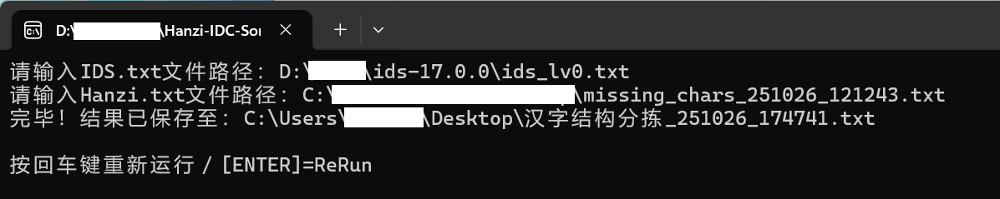

# Hanzi IDC Sort 汉字结构判别分拣

## 简介 Introduction

### 功能 Function

输入汉字列表（txt格式），检测结构数据库（[IDS.txt](https://www.babelstone.co.uk/CJK/IDS.HTML)，字符串格式`U+4E0B	下	^⿱一卜$(GHTJKPV)`）中对应IDS序列中的第一个[IDC](https://www.qiuwenbaike.cn/wiki/表意文字描述字符)符号，进而判别汉字结构完成分拣。

Input a list (txt) of Chinese characters, detect the first [IDC](https://en.wikipedia.org/wiki/Ideographic_Description_Characters) in the IDS in the structure database ([IDS.txt](https://www.babelstone.co.uk/CJK/IDS.HTML), string: `U+4E0B 下 ^⿱一卜$(GHTJKPV)`), and then determine the structure to complete the sorting.

显然，这种检测只是初步判断。如”撒“因其在IDS.txt的对应序列为`U+6492	撒	^⿰扌散$(GHTJKP)`而被归为左右结构，但实际上或许应视为左中右结构。

Obviously, this software is preliminary. For example, the 撒 is classified as a left-to-right structure because its sequence in IDS.txt is `U+6492 撒 ^⿰扌散$(GHTJKP)`, but in fact it might be classified as a left-to-middle-and-right structure more appropriately.

### 下载 Download

在[Releases](https://github.com/Fisher4124/Hanzi-IDC-Sort/releases)页面下载` Hanzi-IDC-Sort.exe`（或[百度网盘](https://pan.baidu.com/s/1qsCvp0IlN3-JCReMhYYlog)）。

Download `Hanzi-IDC-Sort.exe` from the [Releases](https://github.com/Fisher4124/Hanzi-IDC-Sort/releases) page.

### 结构数据 IDS.txt

[魏安](https://www.babelstone.co.uk/)所提供的[IDS.txt](https://www.babelstone.co.uk/CJK/IDS.HTML)。

[IDS.txt](https://www.babelstone.co.uk/CJK/IDS.HTML) by †[Andrew West](https://www.babelstone.co.uk/).

## 著作权声明 Copyright

基于[MIT License](https://opensource.org/license/MIT)协议发布。

Released under the [MIT License](https://opensource.org/license/MIT).
